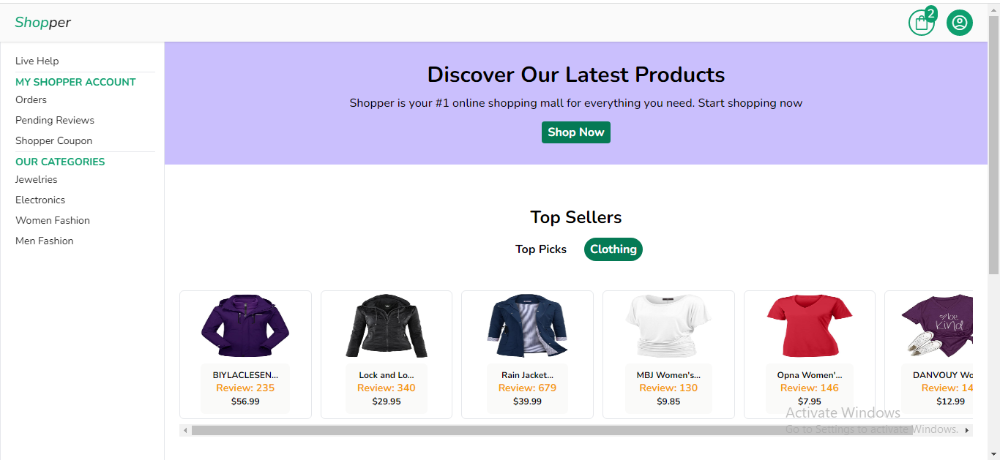
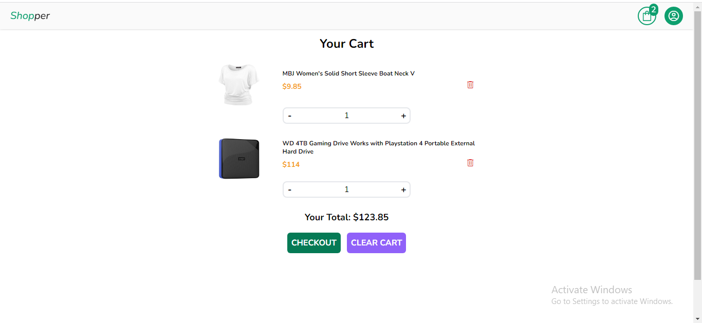
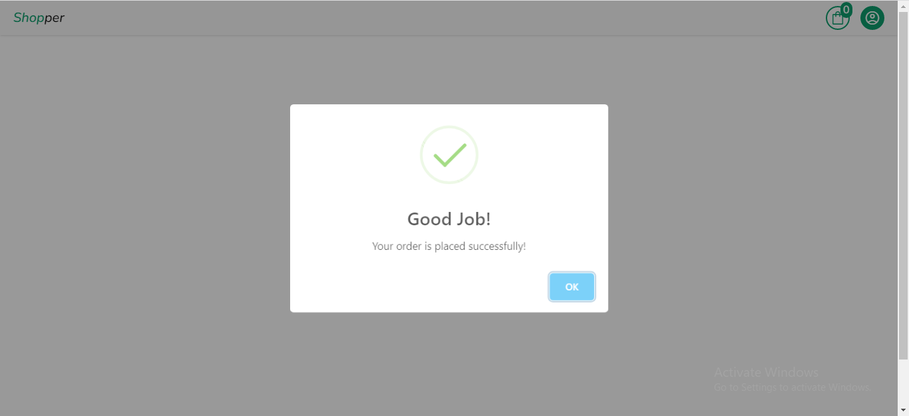

# My Shop :boom:

This is a fully responsive and functional e-Commerce webApp built with Vuejs.:smiling_face_with_three_hearts:

The webApp is live [Here](https://babzshop.netlify.app/).

Star :star: the Repo if you like what you see.:blush:

## Features :star:

- Create Account and Login page.
- View product details page.
- Add to cart.
- Cart items page.
- Increase,decrease and decrease cart items.
- Check out.

## Technologies and Tools used :hammer_and_wrench:
- Vue js
- Vuex
- Tailwindcss
- Visual Studio Code

## Screenshots :camera_flash:

## Author:sunglasses:
##### Akinwobi Babatunde Hezekiah